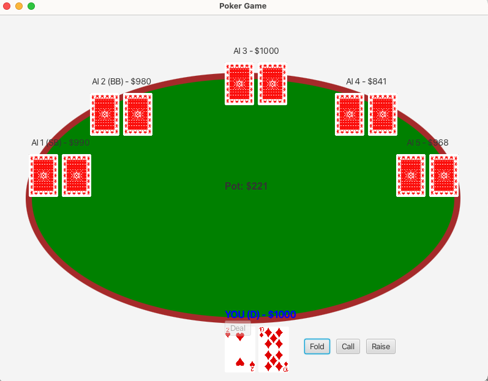
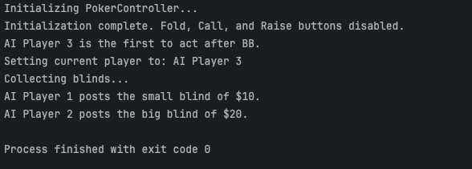
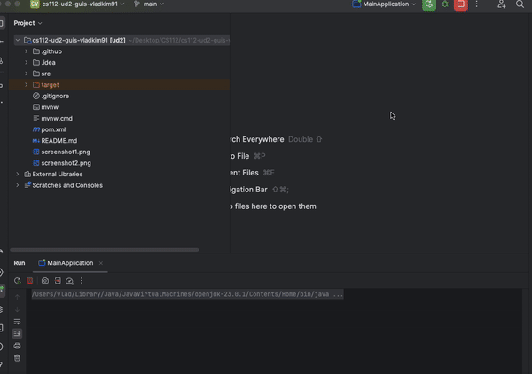
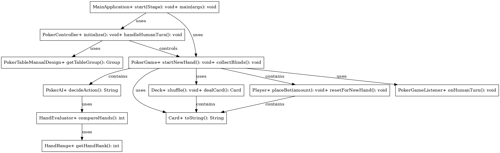

# Texas Hold'em Poker Game

## Description
This is a work-in-progress **Texas Hold'em Poker Game** implemented in Java with JavaFX for the graphical user interface (GUI). The project features dynamic gameplay, a human player competing against AI opponents, and logic based on poker strategies. The project also integrates a GraphQL external API for determining winners.

---

## Features (Completed)

### 1. **User Interface**
- A six-player interface dynamically updates during gameplay.
- AI players’ cards are hidden, and the human player’s cards are visible.
- Highlights the current player’s turn in blue.
- Dynamically updates chip stacks for all players.

---

### 2. **Card and Deck Logic**
- Fully functional card and deck mechanics that shuffle, reset, and deal cards as in a real poker game.

---

### 3. **Dealer and Blinds**
- Dealer, small blind, and big blind positions are assigned dynamically to players.
- Positions are used to determine decision-making logic (e.g., poker table position strategy).

---

### 4. **Hand Evaluation**
- `HandEvaluator` and `HandRange` classes rank hands from 1 to 169, covering all possible combinations.
- AI decision-making is guided by hand strength rankings.

---

### 5. **Betting Logic**
- Human player betting mechanics are implemented, including buttons for folding, raising, and placing bets.

---

### 6. **Poker AI Initialization**
- AI players are initialized with random attributes:
    - **Aggression**
    - **Tightness**
    - **Bluff Frequency**
    - **Risk Tolerance**
- Attributes are randomized within a range of 30–70.

---

### 7. **Core Game Mechanics**
- Collecting blinds.
- Advancing dealer position.
- Dealing cards to players.
- Transitioning player turns.
- Pot management.

---
## GIF of the Working Project

---
## UML Diagram
Below is the UML diagram for the Texas Hold'em Poker game, representing the relationships and methods used in the project:

---
## Tech Stack

### Programming Language and Frameworks:
- **Java**  
  

- **JavaFX**

### API Integration:
- **GraphQL**  
  

### Libraries:
- Java JSON for API communication.

### Development Tools:
- **IntelliJ IDEA**  
  

- **Git**  
  

---

## Future Updates
This project is under development. Planned features include:

1. **AI Decision-Making Logic:**
    - Combine hand strength, table position, pot size, and bet size to make realistic AI decisions.

2. **Game Flow Enhancements:**
    - Implement a complete poker game flow, including community cards (flop, turn, river).
    - Enable automated determination of winners at the showdown using GraphQL integration.

3. **Advanced AI Behaviors:**
    - Refine AI strategies based on poker dynamics.
    - Use machine learning for more adaptive decision-making.

4. **Enhanced User Interface:**
    - Add animations and visual feedback for player actions.
    - Improve card and chip graphics.

5. **Multiplayer Support:**
    - Add support for multiple human players over a network.

6. **Comprehensive Testing:**
    - Ensure robustness with unit tests and integration tests.

---

## Installation

### Prerequisites
- **Java Development Kit (JDK) 17 or higher.**
- **JavaFX SDK.**
- **An IDE** like IntelliJ IDEA or Eclipse.

